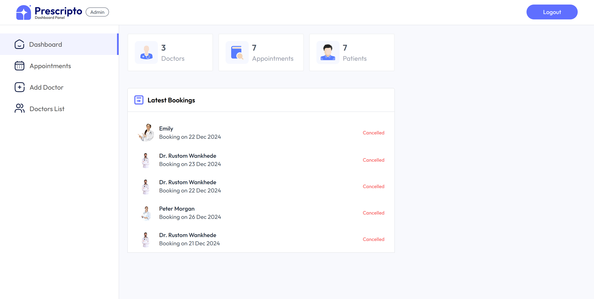

# MediSync App

## Description
MediSync is a modern healthcare management platform designed to facilitate seamless operations for patients, administrators and doctors. The application is divided into three main components: **Frontend**, **Backend**, and **Admin Portal**, each serving a specific role in the ecosystem.

### Key Features
#### Admin Portal:
- Manage appointments and doctors efficiently.
- View comprehensive system analytics and reports.

#### Doctor's Dashboard:
- Manage personal schedules and appointments.
- Access patient records securely.

#### Scalable and Responsive:
- Designed to handle growing user bases.
- Fully responsive across all devices.

### Why MediSync?
- **Streamlined Workflow:** Consolidates operations for easier management.
- **Secure Data Handling:** Ensures sensitive information is protected.
- **User-Friendly Interface:** Simplifies navigation for admins and doctors.

---

## Badges


---

## Visuals

### Admin Portal


---

## Installation

### Prerequisites
- **Node.js** (v16+)
- **npm** or **yarn**
- **MongoDB Atlas** (or another supported database)
- **Cloudinary API keys**
- **Razorpay API keys**
- **OPENAI API keys**

### Steps to Install
#### Clone the Repository
```bash
git clone https://gitlab.com/rezacourses/engi9837_2024/medisync/medisyncapp.git
cd medisyncapp

Open Integrated Terminals
Open separate terminals for the frontend, backend, and admin components.

Frontend Installation
Navigate to the Frontend directory:
cd frontend
npm install
### If there's an issue with Vite, install it manually:
npm i vite
npm run dev


Navigate to the Admin directory:
cd admin
npm install
### If there's an issue with Vite, install it manually:
npm i vite
npm run dev


Navigate to the backend directory:
cd backend
npm install
npm run server

Note: 
1. Create a file .env in the backend folder with code

CURRENCY = "USD"
JWT_SECRET="greatstack"

# Admin Panel Credentials
ADMIN_EMAIL = "admin@example.com"
ADMIN_PASSWORD = "greatstack123"

# MongoDB Setup ( required )
MONGODB_URI = "YOUR MONGODB database cluster link"

# Cloudinary Setup ( required )
CLOUDINARY_NAME = "YOUR_CLOUDINARY_NAME"
CLOUDINARY_API_KEY = "YOUR_KEY"
CLOUDINARY_SECRET_KEY = "YOUR_SECRET_KEY"

# Razorpay Payment Integration
RAZORPAY_KEY_ID = "YOUR_RAZORPAY_KEY"
RAZORPAY_KEY_SECRET = "YOUR_SECRET_KEY"

# OPEN AI KEY SETUP
OPENAI_API_KEY="YOUR_OPENAI_KEY"

2. Create a file .env in the frontend folder with code

VITE_BACKEND_URL = "http://localhost:4000"
VITE_RAZORPAY_KEY_ID = "YOUR_RAZORPAY_KEY"

Usage
Running the Application
Start all components (frontend, backend, admin) using the above steps.

Access the application:
Frontend: http://localhost:5173
Backend API: Server will be started on PORT 4000
Admin Portal: http://localhost:5174

Example Scenarios:
Admin: Log in to the admin portal and manage appointments or doctors.
       Log in the the doctor portal(for a particular doctor) and manage appointments, upcoming appointments, doctor profiles
PatietL Log in to the user portal or create account and Book Doctor's appointment, check symptoms